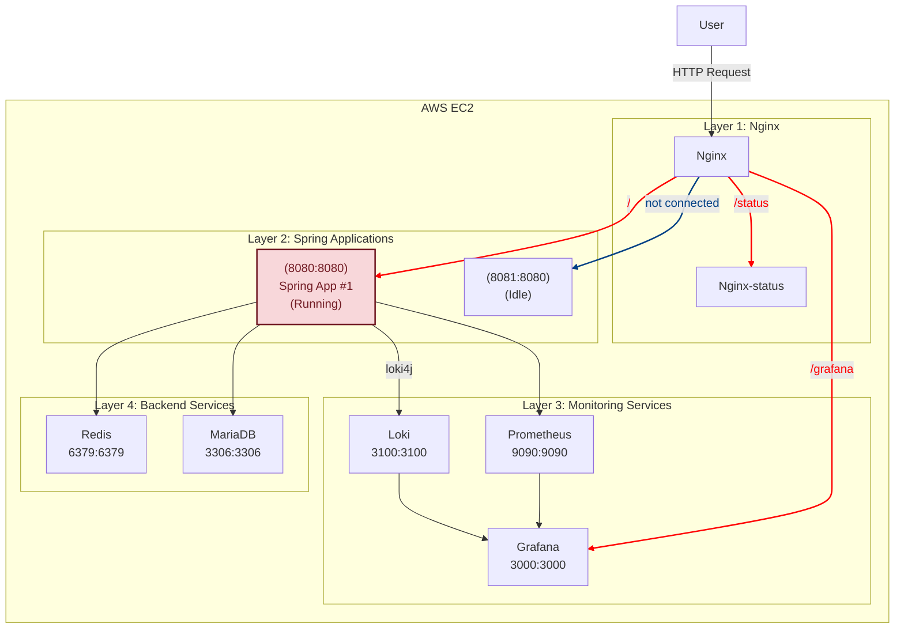
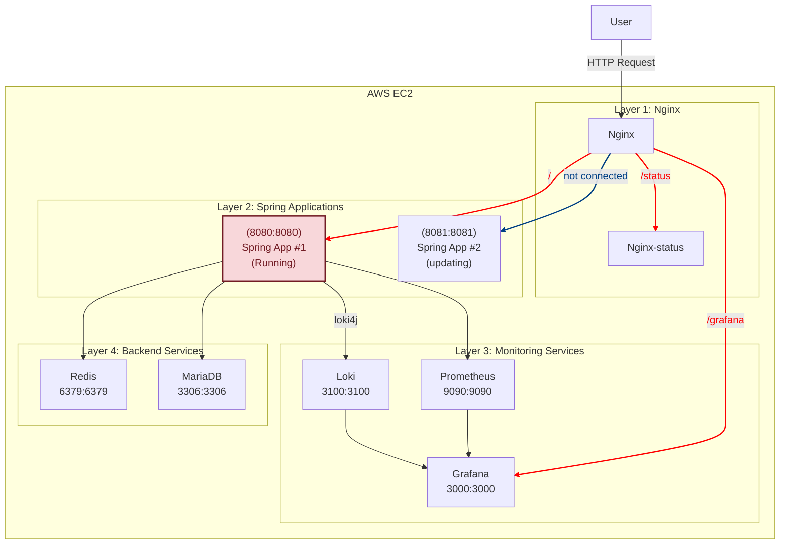
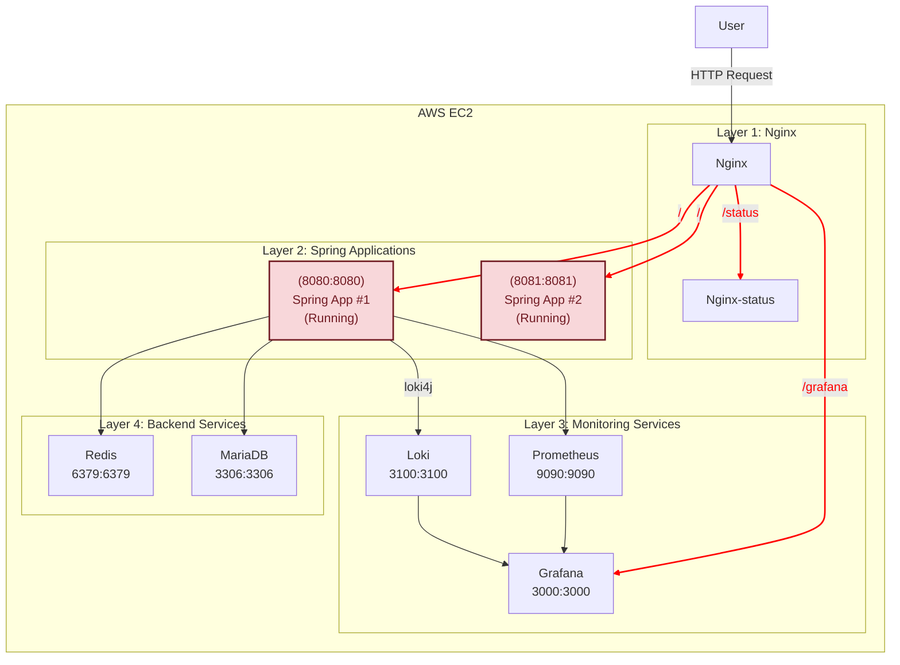
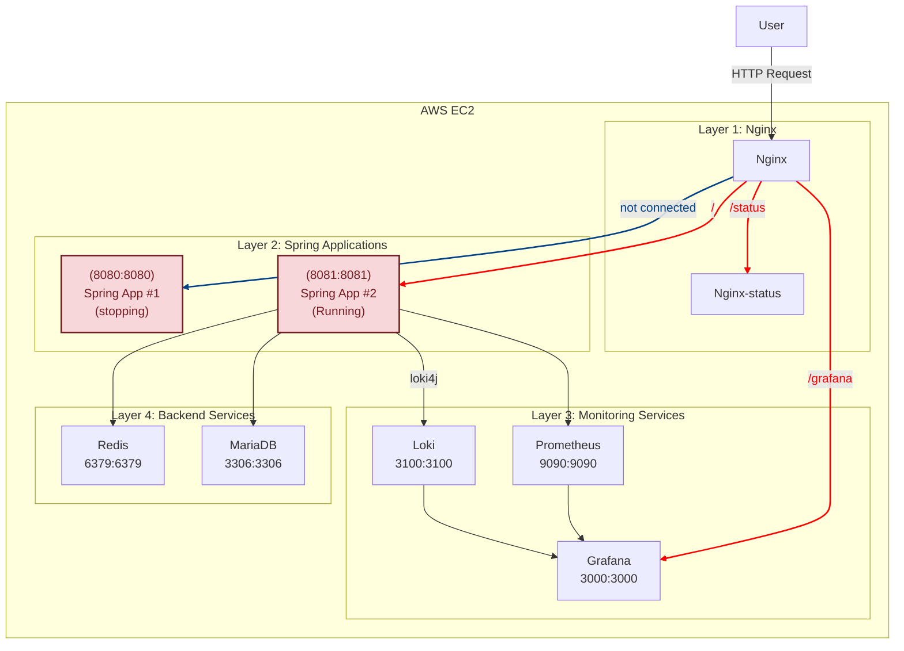
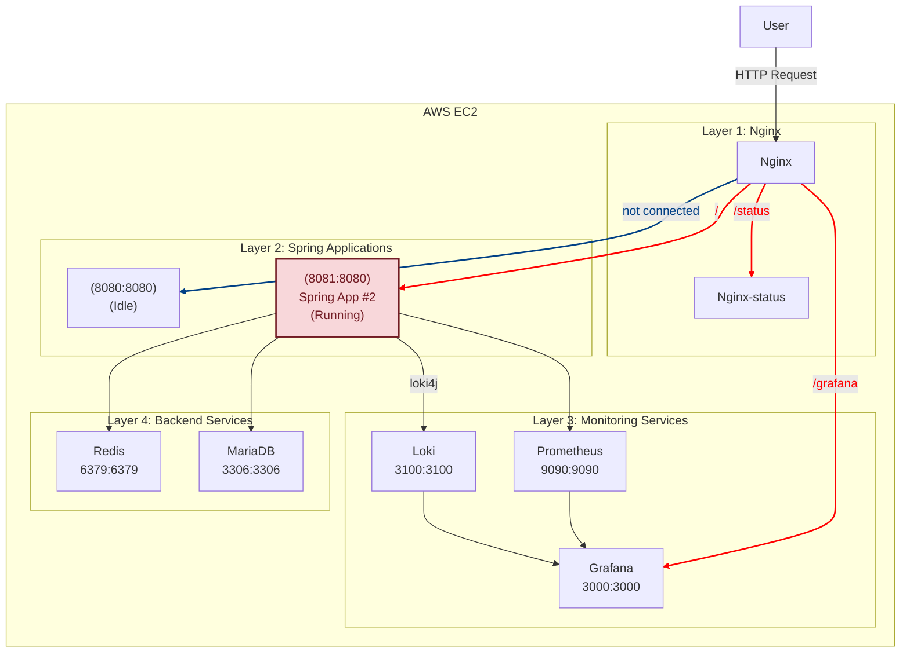

# Spring 애플리케이션을 위한 CI/CD 파이프라인

이 프로젝트는 AWS EC2(프리티어)에서 실행되는 Spring 애플리케이션을 위한 CI/CD 파이프라인을 구현합니다. 인프라는 Spring Boot, MariaDB, Nginx, Redis, Grafana, Loki, Prometheus를 포함하며, 모두 Docker를 통해 컨테이너화되어 있습니다.

## 시스템 구조

### 기본 구조


2. 업데이트 중 상태:



3. 업데이트 후 상태:




- **Nginx**: 모든 요청 처리 및 로드 밸런싱 (Spring App 컨테이너 간)
- **Spring App**: 2개의 인스턴스로 무중단 배포를 지원
- **MariaDB & Redis**: 데이터 저장 및 캐싱
- **Prometheus & Loki**: 모니터링 및 로깅
- **Grafana**: 모니터링 대시보드

## 사전 요구사항

- AWS EC2 인스턴스(프리티어)
- Docker 및 Docker Compose 설치
- Git
- 충분한 메모리 공간(가상 메모리 설정을 권장)

## 프로젝트 구조

```
.
├── .env.template           # 환경 변수 템플릿
├── grafana/                # Grafana, Loki, Prometheus 설정
├── nginx/                  # Nginx 설정 및 Dockerfile
├── rolling_update/         # 롤링 업데이트 스크립트
├── scripts/                # 인프라 관리 스크립트
└── storage/                # MariaDB 및 Redis 설정
```

## 설정 안내

### 1. 스왑 공간 설정(프리티어에 권장)

EC2 프리티어 인스턴스의 제한된 메모리로 인해 충분한 스왑 공간을 설정하는 것이 권장됩니다. 각자 필요에 맞게 스왑 공간을 설정하세요.

### 2. 환경 설정

1. `.env.template`을 `.env`로 복사:
   ```bash
   cp .env.template .env
   ```

2. `.env`에서 다음 변수들을 업데이트:

   #### 프로젝트 설정
   - `PROJECT_NAME`: 프로젝트 이름 (예: myproject)

   #### Spring 애플리케이션 설정
   - `SPRING_INTERNAL_PORT`: Docker 컨테이너 내부 Spring 애플리케이션 포트 (기본값: 8080)
   - `SPRING_APP_PORT_1`: Spring App #1의 외부 노출 포트 (기본값: 8080)
   - `SPRING_APP_PORT_2`: Spring App #2의 외부 노출 포트 (기본값: 8081)

   #### Prometheus 설정
   - `PROMETHEUS_INTERNAL_PORT`: Spring 애플리케이션 내부 Prometheus 포트 (기본값: 8088)
   - `PROMETHEUS_EXTERNAL_PORT`: 외부 노출 Prometheus 포트 (기본값: 9090)
   - `PROMETHEUS_PORT_1`: Spring App #1의 Prometheus 외부 포트 (기본값: 8088)
   - `PROMETHEUS_PORT_2`: Spring App #2의 Prometheus 외부 포트 (기본값: 8089)

   #### Docker 이미지 설정
   - `DOCKER_ACCOUNT_ID`: Docker Hub 계정 ID
   - `DOCKER_REPOSITORY_NAME`: 애플리케이션 저장소 이름
   - `DOCKER_IMAGE_TAG`: Docker 이미지 태그 (기본값: latest)

   #### 데이터베이스 설정
   - `DB_ROOT_PASSWORD`: MariaDB 루트 비밀번호
   - `DB_NAME`: 데이터베이스 이름
   - `DB_USER`: 데이터베이스 사용자 이름
   - `DB_PASSWORD`: 데이터베이스 사용자 비밀번호
   - `DB_PORT`: MariaDB 포트 (기본값: 3306)
   - `DB_TESTDB_NAME`: 테스트 데이터베이스 이름

   #### Redis 설정
   - `REDIS_PORT`: Redis 포트 (기본값: 6379)

   #### Grafana 설정
   - `GRAFANA_PORT`: Grafana 포트 (기본값: 3000)
   - `GRAFANA_USER`: Grafana 사용자 이름
   - `GRAFANA_PASSWORD`: Grafana 비밀번호

   #### Loki 설정
   - `LOKI_PORT`: Loki 포트 (기본값: 3100)

   #### 임시 파일 설정 (수정 금지)
   - `PROMETHEUS_CONFIG_FILE`: Prometheus 설정 파일
   - `DATASOURCES_CONFIG_FILE`: Grafana 데이터소스 설정 파일
   - `DC_PROCESSED`: 처리된 Docker Compose 파일
   - `SQL_PROCESSED`: 처리된 SQL 초기화 파일
   - `NGINX_PROCESSED`: 처리된 Nginx 설정 파일

### 3. Spring 애플리케이션 속성

Spring 애플리케이션의 `application.properties` 또는 `application.yml`이 다음 환경 변수와 일치하는지 확인하세요:

```properties
# 데이터베이스 설정
spring.datasource.url=jdbc:mariadb://mariadb:3306/${DB_NAME}
spring.datasource.username=${DB_USER}
spring.datasource.password=${DB_PASSWORD}

# Redis 설정
spring.redis.host=redis
spring.redis.port=${REDIS_PORT}

# Prometheus 설정
management.endpoints.web.exposure.include=prometheus
management.metrics.export.prometheus.enabled=true

...

# 주의: 위 설정들은 .env 파일의 환경 변수와 정확히 일치해야 합니다.
# DB_NAME, DB_USER, DB_PASSWORD, REDIS_PORT 등의 값이 .env 파일의 값과 동일한지 확인하세요.
```

## 사용법

### 권한 설정
```bash
# 스크립트 실행 권한 부여
chmod +x scripts/*.sh
chmod +x rolling_update/*.sh

# Docker 관련 권한 설정
sudo usermod -aG docker $USER
# 변경사항 적용을 위해 재로그인 필요
```

### 인프라 관리

1. 모든 인프라 시작:
   ```bash
   ./scripts/all-infra-launch.sh
   ```

2. 모든 인프라 종료:
   ```bash
   ./scripts/all-infra-shutdown.sh
   ```

### 롤링 업데이트

애플리케이션 롤링 업데이트 실행:
```bash
./rolling_update/rolling-update.sh
```

롤링 업데이트 스크립트는 다음과 같은 작업을 수행합니다:
1. 최신 Docker 이미지를 자동으로 가져옵니다.
2. 기존 컨테이너를 순차적으로 중지하고 새로운 이미지로 교체합니다.
3. 각 단계마다 애플리케이션의 상태를 확인하여 무중단 배포를 보장합니다.

롤링 업데이트 실패 시:
- 스크립트는 새 컨테이너가 정상적으로 시작되지 않으면 배포를 중단합니다.
- 기존 컨테이너는 그대로 유지되어 서비스 중단이 발생하지 않습니다.
- 실패 로그를 확인한 후 문제를 해결하고 다시 롤링 업데이트를 시도하세요.

### 개별 구성 요소 관리

- Nginx:
  ```bash
  ./scripts/nginx-launch.sh
  ./scripts/nginx-shutdown.sh
  ```

- 스토리지(MariaDB 및 Redis):
  ```bash
  ./scripts/storage-launch.sh
  ./scripts/storage-shutdown.sh
  ```

- PLG 스택(Prometheus, Loki, Grafana):
  ```bash
  ./scripts/plg-launch.sh
  ./scripts/plg-shutdown.sh
  ```

## 모니터링

### EC2 보안 그룹 설정
다음 포트들을 EC2 보안 그룹에서 열어주세요:

#### 웹 서비스 접근 (필수)
- 80: Nginx 웹 서버 (HTTP)

#### 데이터베이스 접근 (선택)
- ${DB_PORT}: MariaDB (기본값: 3306)
- ${REDIS_PORT}: Redis (기본값: 6379)

### 모니터링 도구 접속
- Nginx 상태 확인: `http://your-ec2-ip:80/status`
  - Spring App #1, #2의 상태 확인 가능
  - Grafana 서비스 상태 확인 가능

- Grafana 대시보드: `http://your-ec2-ip:80/grafana`
  - Prometheus 메트릭 시각화
  - Loki 로그 시각화

## CI/CD 통합

이 파이프라인은 CI/CD 플랫폼에서 `./rolling_update/rolling-update.sh` 스크립트를 실행하여 트리거될 수 있습니다.
